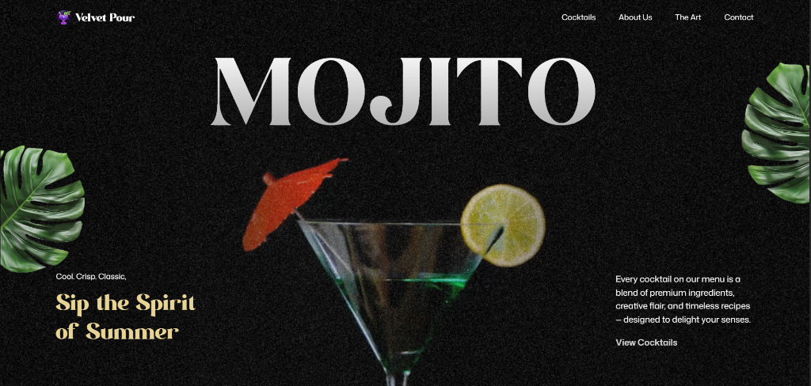
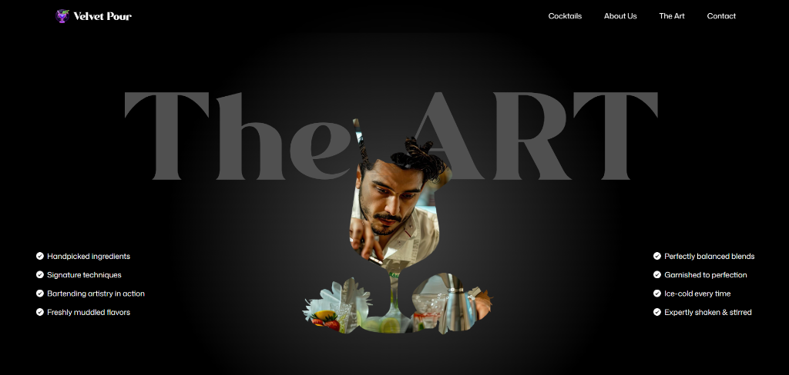
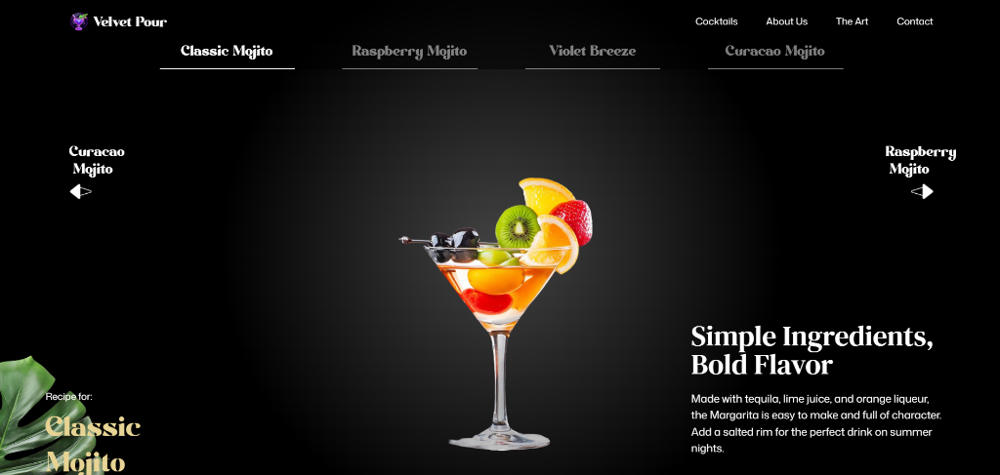

<div align="center">

# 🍹 Mojito Cocktail - Premium Mixology Experience

### _Sip the Spirit of Summer_

[](https://reactjs.org/)
[](https://vitejs.dev/)
[](https://tailwindcss.com/)
[](https://greensock.com/gsap/)
[](https://lenis.darkroom.engineering/)

</div>

---

## 📸 Preview

<div align="center">
  
  <br/><br/>
  
  <br/><br/>
  
</div>

---

## ✨ Features

<table>
<tr>
<td width="50%">

### 🎬 **Cinematic Animations**

Advanced entrance and parallax effects powered by **GSAP** and **ScrollTrigger**. Every scroll reveals a new visual story.

### 🌊 **Buttery Smooth Scroll**

Integrated **Lenis** smooth scrolling for a premium browsing experience that feels like silk.

</td>
<td width="50%">

### 📱 **Fully Responsive**

Pixel-perfect design optimized for all devices - mobile, tablet, desktop, and ultra-wide displays.

### 🎨 **Premium Aesthetics**

Sleek dark mode with glassmorphism, dynamic gradients, and custom typography from Google Fonts.

</td>
</tr>
</table>

### ⚡ **Performance Optimizations**

- Critical asset preloading (fonts, images, logo)
- Optimized font loading strategy (`font-display: swap`)
- Intelligent code splitting and lazy loading
- Vite-powered Hot Module Replacement (HMR)

---

## 🛠️ Tech Stack

### **Core Technologies**

| Technology                                                                                                        | Version    | Purpose                                  |
| ----------------------------------------------------------------------------------------------------------------- | ---------- | ---------------------------------------- |
|                  | **19.2.0** | Component-based UI framework             |
|                      | **7.2.4**  | Lightning-fast build tool and dev server |
|  | **4.1.18** | Utility-first CSS framework              |

### **Animation & Interactions**

| Technology                                                                                         | Version    | Purpose                              |
| -------------------------------------------------------------------------------------------------- | ---------- | ------------------------------------ |
|  | **3.14.2** | Professional-grade animation library |
| **@gsap/react**                                                                                    | **2.1.2**  | React wrapper for GSAP animations    |
| **Lenis**                                                                                          | **1.3.17** | Smooth scrolling library             |

### **Additional Libraries**

| Library              | Version    | Purpose                        |
| -------------------- | ---------- | ------------------------------ |
| **react-icons**      | **5.5.0**  | Icon library for React         |
| **react-responsive** | **10.0.1** | Responsive utilities for React |

### **Development Tools**

| Tool                     | Version   | Purpose                |
| ------------------------ | --------- | ---------------------- |
| **@vitejs/plugin-react** | **5.1.1** | React support for Vite |

---

## 🚀 Getting Started

### **Prerequisites**

- Node.js (v18 or higher)
- npm or yarn

### **Installation**

```bash
# Clone the repository
git clone https://github.com/07HypeR/Gsap_web1

# Navigate to project directory
cd Gsap_web1

# Install dependencies
npm install
```

### **Development**

```bash
# Start development server (http://localhost:5173)
npm run dev
```

### **Production Build**

```bash
# Build for production
npm run build

# Preview production build
npm run preview
```

---

## 🎯 Project Structure

```
Mojito-Cocktail/
├── public/               # Static assets
│   ├── images/          # Image files
│   ├── videos/          # Video files
│   └── fonts/           # Custom fonts
├── src/
│   ├── components/      # React components
│   │   ├── Menu.jsx     # Menu component with parallax
│   │   └── Contact.jsx  # Contact section
│   ├── index.css        # Global styles & Tailwind
│   └── main.jsx         # Application entry point
├── index.html           # HTML template
├── vite.config.js       # Vite configuration
└── package.json         # Dependencies
```

---

## 🎨 Design Philosophy

This project embodies the principles of **modern web design**:

- **Visual Excellence**: Rich aesthetics that wow users at first glance
- **Smooth Interactions**: Micro-animations and hover effects for enhanced UX
- **Premium Feel**: Curated color palettes, sophisticated typography, and glassmorphism
- **Performance-First**: Optimized for speed without sacrificing visual quality

---

## 📱 Responsive Breakpoints

- **Mobile**: < 640px
- **Tablet**: 640px - 1024px
- **Desktop**: 1024px - 1536px
- **Ultra-Wide**: > 1536px

---

## 🤝 Contributing

Contributions, issues, and feature requests are welcome!

1. Fork the project
2. Create your feature branch (`git checkout -b feature/AmazingFeature`)
3. Commit your changes (`git commit -m 'Add some AmazingFeature'`)
4. Push to the branch (`git push origin feature/AmazingFeature`)
5. Open a Pull Request

---

## 📧 Contact

**Abhik** - [abhikbaidya7@gmail.com](abhikbaidya7@gmail.com)

**Project Link**: [https://github.com/07HypeR/Gsap_web1](https://github.com/07HypeR/Gsap_web1)

---

## 📄 License

This project is open source and available under the [MIT License](LICENSE).

---

<div align="center">
  
### 🍸 Crafted with passion, precision, and premium ingredients

**Made with ❤️ by [Abhik](https://github.com/07HypeR)**

[](https://github.com/07HypeR)
[](https://github.com/07HypeR/Gsap_web1)

</div>
